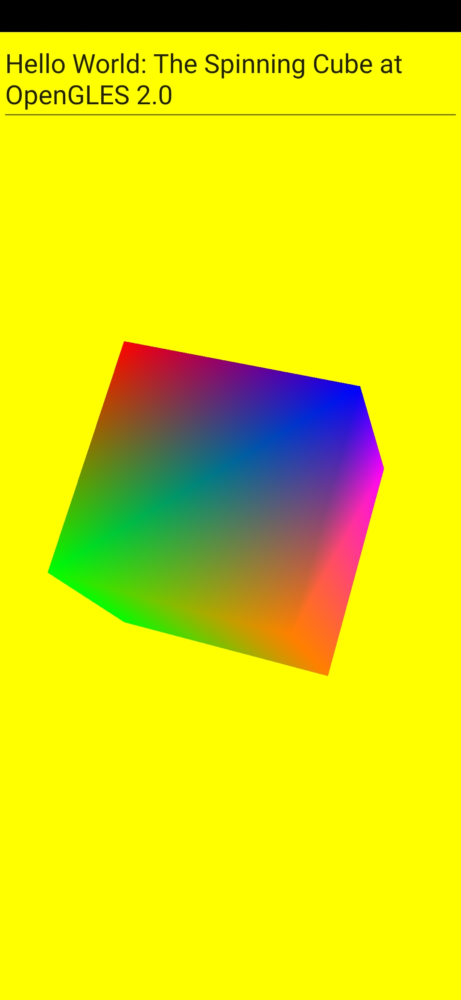
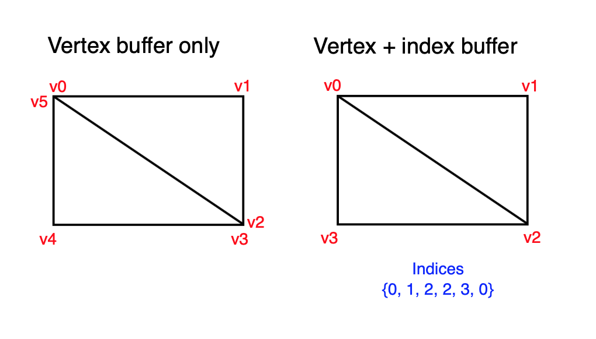
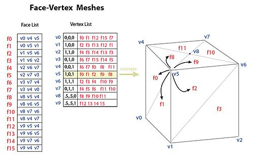

# OpenGLESAndroid
This is a small exercise of creating a spinning cube with OpenGLES API and Android. In addition Unity as Library.

# Vertex and Index buffer
This is the vertex buffer and index buffer explained. 
 

# Cube
Then we can create a cube based on that. 
 
